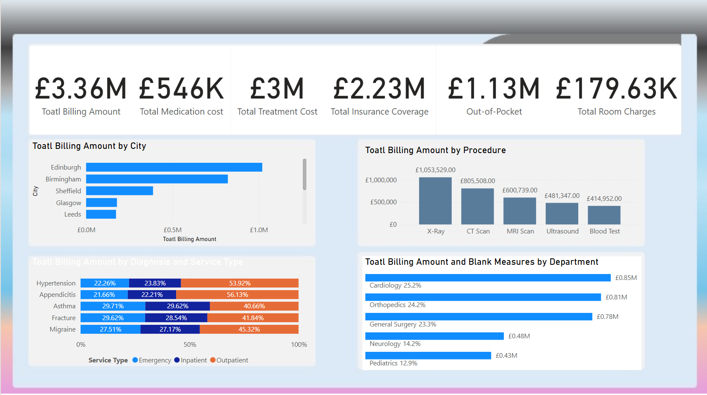

# Healthcare-Billing-Dashboard

This Power BI dashboard analyzes hospital billing data across cities, procedures, departments, and diagnoses. Built as a portfolio project, it demonstrates the ability to transform healthcare data into actionable insights for administrators and analysts.

## Dashboard Features:

- Total Billing Overview: Displays key financial figures like total billing, treatment, medication, insurance coverage, out-of-pocket expenses, and room charges.
- City-wise Billing Distribution: Compares total billing amounts across major UK cities.
- Procedure Analysis: Visualizes revenue from different procedures such as X-Ray, CT Scan, MRI, etc.
- Department Insights: Shows billing contribution by departments like Cardiology, Orthopedics, and Pediatrics.
- Service Type Breakdown: Analyzes billing amounts by diagnosis and service type (Emergency, Inpatient, Outpatient).

## Tools & Skills Used:

- Power BI (Data modeling, DAX, Card visuals, Slicers)
- DAX Calculation Table with:
  - Total Billing Metrics
  - % by Department and Procedure
  - Room, Treatment, and Medication Costs
- Excel for data cleaning
- Custom visuals and color formatting for clarity

## DAX Measures & Data Modeling:

Created a dedicated DAX Calculation table to structure all custom measures, including:

- Basic Financial Metrics: Total Billing, Medication Cost, Treatment Cost, Room Charges, Out-of-Pocket, etc.
- Percentage Metrics: Billing percentage by department and procedure
- Departmental and Patient KPIs: Average stay and blank measure placeholders for flexibility

Organized measures into folders (`Basic Measures`, `Average Measures`, etc.) to enhance model clarity and maintainability.

## Project Structure

- `PowerBI_Files/Healthcare_Dashboard.pbix` – Power BI file
- `Dataset/hospital_data.xlsx` – Sample dataset (mock data)
- `Screenshots/` – Dashboard and DAX structure images

## Sample Dashboard

## Key Learnings

- Built measures to calculate procedure-specific billing
- Used stacked bar charts and clustered columns for comparative insights
- Demonstrated healthcare cost analysis skills applicable to hospital operations and insurance planning

